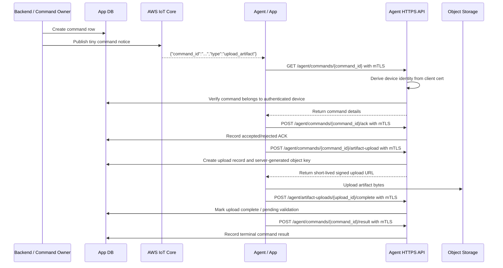

# Artifact Upload Broker Spec

The Artifact Upload Broker is the service boundary for brokered object storage uploads and downloads. This spec exists to prevent topology, diagnostics, backup, or generic object transfer work from leaking into API Facade, Account / Site, or app implementation.

The broker grants temporary object-storage capability. It does not own product state.

## Agent Use

Read this before adding or changing any:

- pre-signed S3 URL flow
- topology snapshot upload
- diagnostics bundle upload
- debug bundle upload
- error log or support log bundle upload
- backup artifact upload
- release artifact download
- app file upload behavior
- object storage metadata model

Do not implement new generic device-origin artifact transfer until a concrete product flow is approved and reconciled with this spec, `api-facade.md`, `workstreams/local-cloud-trust-boundaries.md`, and the owning flow doc (for example backup or diagnostics).

## Current Position

v0 has no topology upload feature and no generic artifact upload/download
feature. Generic device-originated artifact transfer remains deferred until a
concrete product flow is approved. Offsite Home Assistant backup upload is a v0
product flow owned by Backup Service and brokered through this boundary.
Bounded diagnostics, debug, or error-log bundle uploads are allowed only when an
owning Diagnostics/Debug flow explicitly creates an allowlisted command/request
with TTL, redaction, size limits, and audit. They are not a generic v0 upload
surface and must not be implemented as unsolicited device-originated uploads.

HomeSignal app update intent/status is a v0 product capability, but release/update artifact selection and download authority belong to the Release / Update architecture, not to a generic Artifact Upload Broker surface. Do not use update support as a reason to introduce generic object transfer.

Artifact transfer uses a split control/data pattern:

```text
IoT Core
  realtime wake-up/control notice only

Agent HTTPS API
  command details, upload negotiation, signed URL issuance, completion/result reporting

Object storage
  artifact bytes

App DB
  source of truth for devices, commands, uploads, audit, ownership, and status
```

Do not send signed object-storage URLs over IoT Core. IoT messages should remain tiny command notices; command ACK, artifact upload completion, and terminal result reporting use the mTLS Agent HTTPS API.

## Revised Device Upload Flow



Step-by-step:

1. Backend creates a command row in the app DB.
2. Backend sends a tiny IoT Core message to the device, such as `{ "command_id": "...", "type": "upload_artifact" }`.
3. Device receives the command notice over IoT Core.
4. Device calls `GET /agent/commands/{command_id}` over HTTPS using client certificate authentication.
5. Agent HTTPS API authenticates the device from the client certificate.
6. API verifies the command belongs to the authenticated device.
7. Device reports accepted/rejected ACK with `POST /agent/commands/{command_id}/ack`.
8. Device requests an upload session with `POST /agent/commands/{command_id}/artifact-upload`.
9. API creates an upload record and returns a short-lived signed object-storage upload URL.
10. Device uploads artifact bytes to object storage.
11. Device reports completion and terminal command result over HTTPS.

Server-side workers may also ask the broker for an artifact URL for server-side processing. Do not choose a different delivery path without a product-specific service spec.

## Layer Responsibilities

IoT Core owns:

- persistent device connectivity and wake-up
- tiny command notices containing command identity and type
- realtime delivery to connected devices
- no signed URLs, large command details, logs, topology blobs, diagnostics bundles, backup payloads, or secrets

Agent HTTPS API owns:

- `/agent/*` mTLS boundary
- command detail retrieval for authenticated devices
- artifact upload negotiation
- signed upload URL issuance through the broker
- command completion/result reporting from the device
- deriving device identity from the client certificate, not request body fields

Object storage owns:

- large artifact bytes
- private object storage buckets
- short-lived signed upload capability
- no product authority and no raw public access

App DB owns:

- agent records
- certificate identity records
- command rows and status
- artifact upload rows and status
- object bucket/key metadata
- account/site/org ownership
- audit records

## Owns

The Artifact Upload Broker owns:

- artifact upload slot records
- artifact purpose/type registry
- object key allocation
- pre-signed URL issuance
- expected content type and size constraints
- upload completion records
- artifact validation status
- artifact retention metadata
- artifact ownership metadata
- handoff to domain services that consume artifacts

Artifact ownership follows the device/site authority that produced or requested the artifact. If a device later moves or is transferred through an approved flow, artifact visibility must follow the owning product rule for that device/site history rather than raw object-storage location.

## Does Not Own

The Artifact Upload Broker does not own:

- topology as queryable product state
- site/building/zone hierarchy
- device identity
- command authorization
- diagnostics request lifecycle
- backup policy
- release/update orchestration
- raw unrestricted file access on the app
- public bucket/object authority
- permanent device AWS credentials

Domain services own the product meaning of artifacts. The broker owns temporary object-transfer capability and object metadata.

## Security Principles

Pre-signed URLs are bearer capabilities. Treat them as temporary secrets.

Required guardrails:

- mTLS is required for `/agent/*`
- API derives device identity from the client certificate
- backend maps certificate fingerprint/serial to `device_id`
- backend resolves `device_id -> site_id -> org_id`
- reject unknown, revoked, expired, or unbound certificates
- command must belong to the authenticated device
- short TTL
- exact object key
- exact method, such as PUT or GET
- private bucket
- HTTPS only
- size limit
- expected content type
- checksum support when practical
- unguessable object keys
- object key generated server-side
- no AWS credentials delivered to the app
- no signed URLs over IoT Core
- no logging of full signed URLs
- completion/result reporting
- explicit audit for sensitive artifact requests
- never trust `device_id`, `site_id`, or `org_id` from request body

## Device Certificate Boundary

HomeSignal does not own device PKI in v0.

V0 direction:

- The app generates the private key locally.
- The app submits a CSR through the HomeSignal claim flow.
- HomeSignal coordinates AWS IoT `CreateCertificateFromCsr`.
- AWS IoT signs the CSR and returns `certificatePem`, `certificateId`, and `certificateArn`.
- HomeSignal returns `certificatePem` to the app and stores the AWS certificate identifiers plus derived certificate metadata.
- HomeSignal never receives or stores the device private key.
- The HTTPS edge, preferably API Gateway HTTP API custom domain for v0, validates presented client certificates against a truststore.
- The truststore is a CA allowlist stored/configured for the edge; it is not a per-device database and it does not contain private keys.
- Backend maps the presented certificate fingerprint or serial to `device_id`.

HomeSignal may pass the certificate PEM through during claim, but does not need to persist the full PEM. Persist the computed identity fields needed for future device authentication: fingerprint, serial, issuer, AWS certificate ID/ARN, status, `device_id`, `site_id`, and `org_id`.

Credential replacement should support a durable primary/secondary credential model from the start. A device may have one active primary certificate and, during an explicit repair or rotation flow, one temporary secondary certificate. The overlap window should be short, defaulting to a few hours and never exceeding 24 hours without an explicit operational exception. Both credentials map to the same `device_id`; replacing a credential must not create a new product identity or migrate history.

Required identity mapping:

```text
client certificate fingerprint/serial
  -> device_id
  -> site_id
  -> org_id
```

The backend must derive this chain from trusted certificate metadata and app DB records. It must not accept `device_id`, `site_id`, or `org_id` from the device payload as authority.

## Minimal Agent HTTPS Endpoints

```text
GET /agent/commands/{command_id}
POST /agent/commands/{command_id}/ack
POST /agent/commands/{command_id}/artifact-upload
POST /agent/artifact-uploads/{upload_id}/complete
POST /agent/commands/{command_id}/result
```

Endpoint rules:

- all endpoints require mTLS
- all endpoints derive `device_id` from the verified client certificate
- command ACK verifies the command belongs to the authenticated device
- command endpoints verify the command belongs to the authenticated device
- upload completion verifies the upload belongs to the authenticated device and command
- command result verifies the command belongs to the authenticated device

## App Local Gate

The app must not accept arbitrary upload commands.

Future app artifact behavior must be allowlisted by artifact type. The cloud may request a known artifact type; it must not provide an arbitrary local file path.

Allowed future shape:

```text
upload known generated artifact type
  topology_snapshot
  diagnostic_bundle
  error_log_bundle
```

Disallowed shape:

```text
upload arbitrary local file path
```

The app must validate:

- command type is allowlisted
- artifact type maps to locally generated content
- max bytes are enforced locally
- command details come from the authenticated Agent HTTPS API
- signed URL response is HTTPS and near-term
- destination host matches approved object-storage patterns
- method, content type, size, and checksum expectations match the upload session
- result is reported through the Agent HTTPS API
- upload failures do not recursively request more error-log uploads

## Product State Boundary

Object storage holds bytes. Product services hold authority and current state.

Examples:

- Account / Site owns site/building/zone hierarchy, not topology blobs.
- A dedicated topology/domain service may later own queryable topology state if topology becomes product data.
- Diagnostics may own diagnostic request lifecycle and redaction policy.
- Backup may own backup request/status metadata.
- Release / Update Orchestrator may own release artifact selection and rollout state.

The Artifact Upload Broker records where the object is and whether the transfer/validation succeeded. It does not decide what the object means to the product.

## Future Metadata Shape

A brokered artifact record should include:

- typed artifact/upload ID
- purpose
- owning account ID
- site ID, when applicable
- device ID, when applicable
- requested_by subject
- object bucket/key
- content type
- expected size or max size
- checksum, when provided
- trigger event ID, command ID, or diagnostic request ID
- local artifact reference, when supplied by the app
- redaction profile
- manifest object key or manifest checksum, when applicable
- status
- created_at
- expires_at
- completed_at
- validated_at
- rejected_reason

## Deferred Purpose Types

Known future purposes:

- `topology_snapshot`
- `diagnostic_bundle`
- `debug_bundle`
- `error_log_bundle`
- `backup_artifact`
- `release_artifact`

`error_log_bundle` is for large logs associated with a specific command, policy application failure, diagnostic request, or app incident. It is a brokered artifact, not an MQTT event. The corresponding MQTT event or command result may carry a redacted diagnostic excerpt capped at 5 KB total, plus `more_logs_available` and a local correlation/upload request ID.

Upload-failure recursion guard:

- failure to upload an `error_log_bundle` may emit one bounded `artifact_upload_failed` alarm
- that alarm must not set `more_logs_available=true` by default
- cloud must not automatically request another `error_log_bundle` for an `error_log_bundle` upload failure
- repeated upload failures collapse by device, artifact purpose, failure reason, and time window

Do not implement these by default. Each purpose needs a service-owned flow and acceptance criteria before code.

## Default Artifact Guardrails

Artifact uploads are authenticated device flows, but they are still bounded because a stolen or misused device credential would otherwise become an expensive upload capability.

Default upload URL TTL:

- normal default: 15 minutes
- small retry window: 30 minutes maximum
- longer TTL requires purpose-specific approval

Default size limits by purpose:

| Purpose | Default max | Content expectations |
| --- | ---: | --- |
| `error_log_bundle` | 5 MB | Redacted text, NDJSON, JSON, or compressed text logs. No secrets, private keys, claim invite codes, full signed URLs, or raw local config dumps. |
| `diagnostic_bundle` | 25 MB | Redacted JSON/text reports, health snapshots, selected app logs, and optional compressed bundle manifest. No broad Home Assistant config snapshot in v0. |
| `debug_bundle` | 25 MB | Time-boxed support/debug capture for one device or site. Redacted logs, command summaries, connectivity checks, and runtime facts only. |
| `topology_snapshot` | 10 MB | JSON or compressed JSON produced by the app. Not v0 unless topology upload is approved. |
| `backup_artifact` | 250 MB | Purpose-owned Home Assistant backup payload or manifest. V0 only under Backup Service ownership. |
| `release_artifact` | Purpose-owned | Release/update architecture owns download authority and artifact size, not generic upload. |

Allowed content types should be purpose-specific but not overly narrow. Start with JSON, NDJSON, plain text, gzip/zstd-compressed text or JSON, and zip/tar archives only when a manifest and redaction profile are defined. Binary payloads are allowed only for a purpose that explicitly needs them.

Every upload session should include expected max size, content type, checksum when practical, object key, expiry, purpose, and owning command/request ID. Object storage enforces size and method where possible; the broker validates metadata and records rejected/expired/oversize completions.

## Out Of Scope v0

- topology upload
- unsolicited diagnostics bundle upload outside an approved Diagnostics/Debug flow
- unsolicited error log bundle upload outside an approved Diagnostics/Debug flow
- release artifact download brokering
- generic `/artifact-uploads` public routes
- IoT-delivered signed URL commands
- public S3 object URLs
- permanent S3 credentials on devices
- unrestricted local file upload

## Acceptance Criteria For Future Implementation

- A product-specific service spec identifies the artifact purpose and owning domain service.
- IoT Core carries only the tiny command notice; Agent HTTPS API handles command detail, ACK, upload negotiation, completion, and result.
- Device-originated availability events are small hints, not upload authorization.
- Authorization action and local app gate are defined.
- Signed URL TTL, method, content type, size, and object key scope are defined.
- `/agent/*` mTLS trust boundary is defined.
- Certificate fingerprint/serial maps to `device_id -> site_id -> org_id`.
- Full signed URLs are redacted from logs.
- Metadata record and completion path are defined.
- Sensitive artifact requests are audited.
- Upload-failure recursion guard is tested.
- Tests cover expired URL, wrong destination, oversize upload, invalid purpose, and local path injection attempts.
