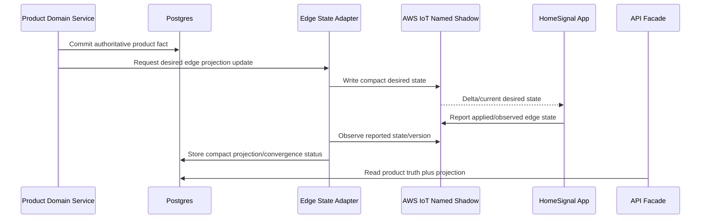

# Edge State Adapter

The Edge State Adapter is the HomeSignal boundary around AWS IoT named shadows. It exists so HomeSignal can use shadows for v0 edge desired/reported state without turning shadows into a second product database or prematurely building a custom Device Twin service.

## Purpose

Use AWS IoT named shadows for compact device-edge state exchange:

- cloud writes desired edge state
- device reports applied/observed edge state
- HomeSignal stores only the compact projection needed for product reads, convergence checks, and support

The adapter owns shadow I/O and projection. It does not own the source-of-truth business facts that produce desired state.

## Agent Use

Read this before adding or changing:

- AWS IoT named shadow documents
- desired/reported edge state
- publish-policy delivery to devices
- device convergence projections
- product-service writes that need to reach the app as durable desired state
- replacements for AWS IoT shadows or a future HomeSignal Device Twin service

Also read:

- `workstreams/state-change-and-policy-propagation.md`
- `command-lifecycle.md`
- `aws-iot-routing-contract.md`
- `telemetry-ingest-architecture.md`
- `service-map.md`

## Vocabulary

Use these names consistently:

| Term | Meaning |
| --- | --- |
| Edge State Adapter | HomeSignal logical boundary that reads/writes AWS IoT named shadows and projects compact state into HomeSignal storage |
| AWS IoT named shadow | AWS-managed device shadow document used for compact `desired` and `reported` edge state |
| Desired edge state | Durable cloud target the device should converge toward |
| Reported edge state | Device-reported applied/observed value for the compact desired-state surface |
| Edge state projection | Small HomeSignal DB read model derived from shadow reported state and HomeSignal product authority |

Avoid ambiguous names such as "bridge" or "sync." Avoid "Device Twin Service" for v0 unless the design is explicitly replacing AWS shadows with a HomeSignal-owned twin service.

## Ownership

The Edge State Adapter owns:

- named shadow selection and document shape
- writes to shadow `desired`
- reads/subscriptions for shadow `reported` and delta/convergence signals
- shadow version handling, stale update handling, and adapter retries
- projection of compact convergence facts into HomeSignal storage
- adapter-level metrics and failures

The Edge State Adapter does not own:

- account, site, user, role, plan, or entitlement authority
- device claim or credential lifecycle
- publish-policy business resolution
- command authorization
- command lifecycle records
- telemetry/event ingestion
- raw logs, topology blobs, backups, diagnostics bundles, or release artifacts
- a full copy of every shadow document in Postgres

## Source Of Truth Rule

There must be one owner for each fact.

| Fact | Authority | Edge State Adapter role |
| --- | --- | --- |
| Account/site/device ownership | Account/Site and Device Registry | Reads derived identifiers only |
| Effective publish policy | Publish Policy / Device Registry domain | Writes compact desired policy reference/version to shadow |
| Device applied publish policy version | Device reports through shadow `reported` | Projects compact convergence status to DB |
| Desired app/supervisor version | Release / Update Orchestrator | Writes compact desired version/pointer to shadow when that flow exists |
| Device observed app version | Device reports through telemetry or shadow, depending on schema | Projects only the product-needed latest fact |
| Command ACK/result | Command Service | Not shadow state; command lifecycle remains separate |
| Topology, logs, diagnostics, backups | Artifact/Topology/Diagnostics/Backup owners | Not stored in shadow except tiny availability hints if a later spec chooses that |

Postgres remains the product authority. Shadows are the edge exchange surface. DB projections derived from shadows must be labeled and rebuildable; they are not independent truth.

## Default Flow



Example:

```text
Product truth:
  device active publish policy = pp_124

Shadow desired:
  publish_policy.version = pp_124
  publish_policy.ref = stable cloud-resolved policy reference, if needed

Shadow reported:
  publish_policy.active_version = pp_124
  publish_policy.applied_at = timestamp

DB projection:
  desired_policy_version = pp_124
  reported_policy_version = pp_124
  convergence_status = converged
```

Do not copy the whole shadow document into the DB by default. Store the fields HomeSignal needs for product behavior, support, stale-state detection, and dashboards.

## Desired State Vs Commands

Named shadows are the default v0 mechanism for durable desired edge state.

Commands remain for bounded operations with identity, expiry, ACK, and result. A command may accelerate or repair convergence, but it is not the default storage place for durable desired state.

V0 uses exactly one named shadow:

```text
homesignal_edge
```

Use `homesignal_edge` desired/reported for:

- active publish policy version
- small resolved publish-policy values the app needs immediately, such as enabled event families and telemetry cadence
- desired app/supervisor version or update channel pointers

Keep backup, diagnostics, topology, artifacts, logs, command history, and routine health out of the shadow unless a later service spec introduces a concrete durable desired-state need.

Use commands for:

- `refresh_publish_policy` as a bounded repair or acceleration request
- `trigger_backup`
- update status/repair commands where explicitly supported
- future `upload_artifact`
- future `run_diagnostic`
- future `test_remote_access`

Use notifications only as hints. Notification delivery is never proof that a device accepted or applied desired state.

## Shadow Document Rules

- Use the named shadow `homesignal_edge` for v0.
- Keep the shadow compact and purpose-specific.
- Store version/reference pointers plus tiny resolved config values where the app needs them to converge immediately.
- Store references, versions, booleans, and small status summaries, not bulky payloads.
- Do not store raw logs, stack traces, topology blobs, full publish-policy documents, signed URLs, secrets, backup payloads, or diagnostic bundles in shadows.
- Treat shadow `desired` as cloud-authored through the adapter.
- Treat shadow `reported` as device-authored.
- If a product service needs to change device desired state, it calls the Edge State Adapter instead of writing directly to AWS IoT.
- If the app needs to report applied desired state, it writes shadow `reported`; ordinary telemetry/events remain on the runtime ingest path.
- Do not clear durable desired fields automatically after convergence; desired state remains the target until superseded.
- Use shadow versions/timestamps to ignore stale updates.
- Keep the payload small enough that the design remains comfortably below AWS IoT shadow document quotas.

## V0 Shadow Shape

This is the v0 shape. Field names are contract-level and should change only through the Edge State Adapter owner.

```json
{
  "state": {
    "desired": {
      "publish_policy": {
        "version": "ppv_123",
        "ref": "publish-policies/ppv_123",
        "refresh_after": "2026-05-14T12:00:00Z",
        "expires_at": "2026-05-20T12:00:00Z",
        "telemetry_cadence_seconds": 3600,
        "enabled_event_families": ["agent_alarm"]
      },
      "update": {
        "desired_version": "0.1.4",
        "channel": "stable",
        "rollout_id": "rollout_456"
      }
    },
    "reported": {
      "publish_policy": {
        "active_version": "ppv_123",
        "status": "applied",
        "applied_at": "2026-05-13T12:05:00Z"
      },
      "update": {
        "current_version": "0.1.4",
        "status": "applied",
        "reported_at": "2026-05-13T12:10:00Z"
      }
    }
  }
}
```

Allowed v0 sections:

- `publish_policy`
- `update`

Reported failure detail is limited to bounded status and reason fields:

```json
{
  "status": "failed",
  "reason_code": "unsupported_policy_schema"
}
```

The `update` section is the compact desired/reported convergence surface for
HomeSignal app version intent. It does not deliver update artifacts or
force installation. CI/CD or release tooling publishes the app version through
the normal Home Assistant/GitHub release path first; the Release / Update
Orchestrator and Edge State Adapter then promote a desired version/channel into
the shadow when HomeSignal wants a cohort to converge. Reported update state lets
HomeSignal see which devices have taken the update.

Do not include stack traces, logs, full policy blobs, release artifacts, download URLs, signed URLs, large local state, or user/customer data in shadow failure detail.

## Device Reported Update Triggers

The app must not update shadow `reported` on a heartbeat or fixed telemetry cadence. Shadow operations are costed and should represent convergence, not routine reporting.

The app should update shadow `reported` only when one of these happens:

- it observes a shadow `desired` delta and successfully applies the relevant desired state
- it observes a shadow `desired` delta and rejects or cannot apply it, with a bounded reason code
- local durable edge state changes in a way that affects a desired-state contract, such as active publish-policy version, accepted policy expiry, or desired app/update version
- the app reconnects or restarts and discovers that its local applied state differs from the current shadow `desired`
- a bounded repair path such as `refresh_publish_policy` changes or confirms the applied desired-state version
- the app detects local policy drift, rollback, missing policy, or another compact convergence/security condition that the cloud must know to reason about desired state

The app must not update shadow `reported` for:

- routine telemetry snapshots
- routine health heartbeats
- backup summaries
- topology snapshots or topology blobs
- Home Assistant event streams
- logs, diagnostics bundles, stack traces, or artifacts
- command ACK/progress/result records
- upload completion
- large status payloads that belong in telemetry/events, artifacts, or a domain service

Default cost posture:

- shadow updates are event-driven by desired-state convergence or drift
- no periodic shadow reporting unless a future spec explicitly defines a low-frequency reconciliation need
- each reported update should change at least one compact convergence field or bounded reason code
- unchanged reported state should be suppressed locally

## Storage Rules

Store:

- current desired edge version/reference
- last reported/applied edge version/reference
- reported timestamp and adapter-observed timestamp
- convergence status
- stale/error reason code, when bounded
- shadow name/version metadata needed for debugging

Convergence projection is internal/support-visible in v0. Do not expose normal customer-facing convergence UI until a product spec defines when it is useful and how it should be explained.

Do not store:

- complete shadow document history by default
- full desired policy blobs if the authoritative policy exists elsewhere
- raw AWS shadow metadata unless it supports debugging or stale-write protection
- large reported state that belongs in telemetry, artifacts, or a future domain service

## Failure Semantics

- If the adapter cannot write desired state to AWS IoT, product truth remains committed but edge convergence is pending/failed.
- If the device does not report convergence, HomeSignal must not assume success.
- If the device reports a suspicious or impossible value, quarantine or flag the projection instead of updating product state.
- If shadows become unavailable, device local behavior falls back to last accepted local policy or conservative defaults as defined by the policy workstream.
- Missing ACK behavior for commands remains separate from shadow convergence behavior.

## Future Replacement Seam

If AWS IoT shadows become insufficient, replace the Edge State Adapter implementation with a HomeSignal Device Twin service behind the same logical boundary.

Reasons that might justify replacement later:

- desired/reported documents outgrow shadow size or shape constraints
- richer query/history requirements become product-critical
- multi-cloud or non-AWS device transport becomes real
- stronger transactional coupling with HomeSignal product state is required
- shadow operation cost, quota, or operational behavior becomes limiting

Until then, do not build a second twin system beside AWS shadows.

## References

- AWS IoT Device Shadow service: https://docs.aws.amazon.com/iot/latest/developerguide/iot-device-shadows.html
- AWS IoT Core quotas: https://docs.aws.amazon.com/general/latest/gr/iot-core.html

## V0 Decisions (Closed)

- V0 shadow name/schema is settled. Future sections beyond `publish_policy` and
  `update` require an owning service spec.

## Acceptance Criteria

- Product services do not write AWS IoT shadows directly.
- Shadows are used for compact desired/reported edge state, not bulky payloads.
- Postgres stores product truth plus compact projections, not a full shadow mirror.
- Commands remain distinct from durable desired state.
- Telemetry/events remain on the runtime ingest path.
- A future HomeSignal Device Twin service can replace the adapter without rewriting upstream product-service ownership.
