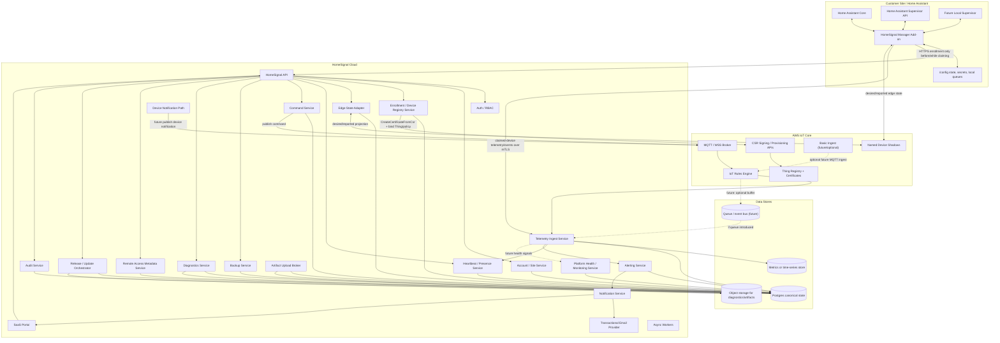
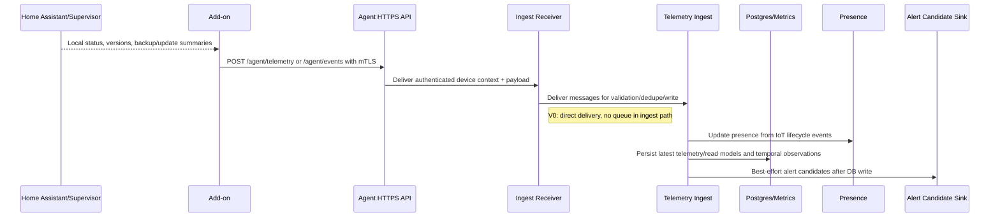
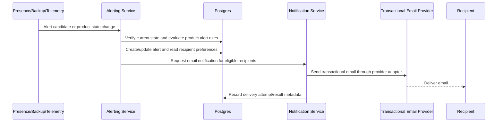
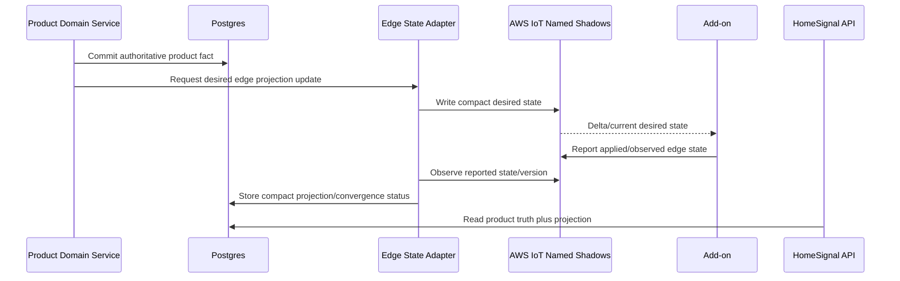
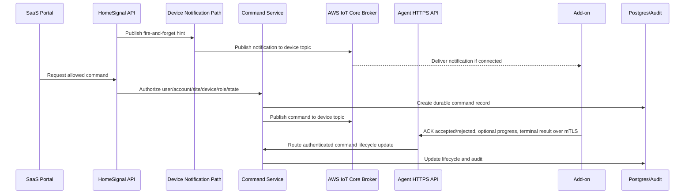
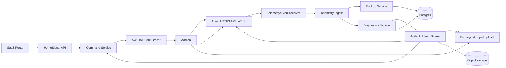
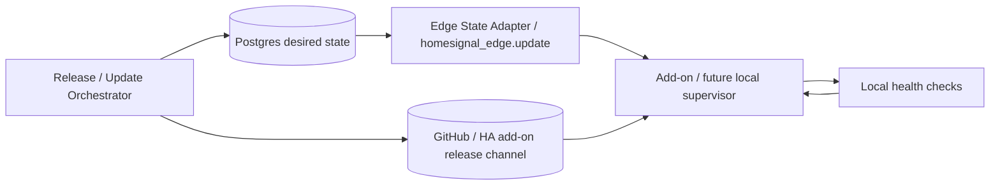

# HomeSignal Service Map

This is the broad HomeSignal architecture map. It includes current services, near-term services, and future services so individual feature work can land in the right ownership boundary.

The current repository implements the Home Assistant add-on and enrollment client contract only. Most cloud services in this map are target architecture, not code that exists in this repo today.

V0 physical deployment is intentionally simple: the API Facade and domain services live in one control-plane monolith. Telemetry Ingest is the only v0 service that should be separately deployable, because it owns the runtime device telemetry/event ingestion path behind the authenticated Agent HTTPS API. Other boxes in this map are logical ownership boundaries unless a later spec explicitly promotes them to separate deployables.

The canonical relational database may be Neon Postgres in v0 for cost and
velocity. Service boundaries should treat PostgreSQL as the contract and keep a
future RDS move as a provider migration, not a domain architecture change.

Even inside the control-plane monolith, logical services should keep typed,
adapter-friendly contracts. In-process calls should resemble the request/context
and response/error shapes that would be used across an internal HTTP boundary
later, so pulling a logical service into its own deployable is mostly an adapter
and deployment exercise rather than a domain rewrite.

When logical services are physically split inside AWS, service-to-service HTTP
calls should authenticate with AWS IAM/SigV4 by default. HomeSignal maps the
verified AWS role/principal to an app-level service subject and still performs
named authorization for sensitive actions.

Device lifecycle, trust, and authority rules are canonicalized in `workstreams/device-lifecycle.md`. Service boundaries in this map should be read against that lifecycle model.

## System Map



## Current, Next, Future

| Phase | Services |
| --- | --- |
| Current in this repo | HomeSignal Manager add-on, local enrollment state, local `/ui`, `/status`, `/readyz`, mockable HomeSignal enrollment client, mockable AWS provisioning client |
| Immediate next | Control-plane monolith with API enrollment endpoints, Postgres enrollment schema, device registry, audit events, SaaS pairing form |
| Next AWS step | AWS IoT provisioning adapter for `CreateCertificateFromCsr`, Thing/certificate binding, IoT policy attachment, and real add-on CSR submission/storage |
| MVP after enrollment | Separately deployable Telemetry Ingest, IoT lifecycle presence, basic telemetry/events, Edge State Adapter module, portal device status, release/revocation, backup status/trigger, HomeSignal add-on update intent/status |
| MVP portal completion | Customer-facing email alerts for disconnected devices, backup failures, and add-on/update attention using Alerting Service plus Notification Service with a Resend-backed transactional email provider adapter |
| Later | richer desired-state drift, diagnostics bundle product workflows, platform health monitoring, local supervisor hardening, progressive release rings, richer telemetry, optional remote access integrations, additional notification channels |

## Service Ownership

| Service | Owns | Does Not Own |
| --- | --- | --- |
| HomeSignal Manager add-on | Local install identity, local claim state, local private key, local cert files, Home Assistant/Supervisor observations, telemetry collection, local degraded behavior | Account/site/user authority, audit authority, cloud command authorization, AWS policy/template setup, direct post-claim API writes |
| Future Local Supervisor | Safe local update execution, artifact verification, rollback, local diagnostics/recovery | SaaS product workflows, arbitrary command execution, telemetry analytics |
| SaaS Portal | Authenticated user workflows, site/device UX, claim invite creation, dashboards, alerts, team/admin screens | Device credentials, browser-stored authority, direct AWS credential delivery |
| HomeSignal API / API Facade | Public/control-plane HTTP surface, request authentication, external API contracts, route glue, request context, idempotency, rate limiting, composed portal read models, delegation to domain services | Domain state transitions, authorization decisions, direct database access, local HA operation, direct edge filesystem state |
| Auth / RBAC | Users, roles, permissions, session auth, service auth | Device transport state |
| Account / Site Service | Accounts, account status, account-scoped customer records, sites, buildings, zones, site relationships, site lifecycle, device placement rules | Users, account memberships, roles, permissions, device certificates, device claim lifecycle, telemetry ingestion, topology snapshots, billing |
| Enrollment / Device Registry Service | Claim invites, claim verifications, devices, credential metadata, release state, final claim authority | Local private keys, raw telemetry analytics |
| Edge State Adapter | AWS IoT named shadow boundary, compact desired/reported edge state, shadow document shape, projection of convergence status into HomeSignal storage | Product authority, business policy resolution, full shadow mirroring, raw telemetry/events, local command execution |
| Heartbeat / Presence Service | Last seen, online/offline/stale/degraded state | Raw device registry ownership |
| Command Service | Durable command lifecycle, command authorization, queueing, expiry, results | Arbitrary shell execution, cloud-side mutation without device ACK |
| Device Notification Path | Fire-and-forget cloud-to-device hints and convergence nudges | Customer email/in-app notifications, command lifecycle, proof of local state change |
| Telemetry Ingest Service | Validating, normalizing, deduplicating, and storing device telemetry/events; routing latest state, backup summaries, health summaries, and alert candidates | User-facing dashboard rendering, command authorization |
| Platform Health / Monitoring Service | Future internal cross-service health findings, monitor rules, runaway device messaging detection, suppression/cooldown, remediation recommendations | Raw metrics storage, customer alert lifecycle, direct device lifecycle mutation, direct command execution |
| Alerting Service | Product/customer-facing alert lifecycle when a product rule promotes a candidate: alert creation, severity, acknowledgement, resolution, snooze, recipient preference evaluation, and notification request creation | Raw telemetry transport, platform-health findings by default, direct device mutation, direct email provider calls |
| Backup Service | V0 logical service for backup trigger requests, backup policy/status records, command/result interpretation, last success/failure, overdue/in-progress state, backup summary metadata, and offsite Home Assistant backup artifact product meaning | Running arbitrary local backup code outside the add-on or generic artifact transfer |
| Diagnostics Service | Explicit diagnostic request lifecycle, redaction policy, diagnostic bundle metadata; v0 scope is only where a concrete command or error-log artifact flow requires it | Silent/unprompted large uploads, generic object-transfer authority |
| Artifact Upload Broker | Short-lived pre-signed object-storage URL brokering and artifact transfer metadata for approved product flows | Product state, unrestricted local file access, public bucket/object authority |
| Remote Access Metadata Service | Optional provider metadata such as manual URL, Nabu Casa, Tailscale, Cloudflare Tunnel, notes, last verified | Required LAN access or VPN operation |
| Release / Update Orchestrator | Agent release channels, rollout rings, desired version, compatibility policy, rollout halt/resume | Direct unsafe mutation of customer hosts |
| Audit Service | Sensitive action audit events and immutable history | Operational command execution |
| Notification Service | Transactional notification delivery for product alerts and important state changes; v0 channel is email through a Resend-backed provider adapter | Source-of-truth status, alert lifecycle authority, platform-health findings by default, recipient policy decisions |
| Transactional Email Provider | Resend adapter by default in v0; external provider adapter for sending email messages requested by Notification Service | HomeSignal product state, alert lifecycle, recipient preference authority, public API shape |
| AWS IoT Core | Device certificate auth, Thing registry, MQTT/WSS broker, Rules Engine routing, named device shadows | HomeSignal account/site/user authorization |

## Core Data Stores

| Store | Data | Notes |
| --- | --- | --- |
| Add-on `/config/device.json` | Installation ID, claim state, device ID, IoT Thing name, cert/key paths, pending metadata | Metadata only; no secret contents |
| Add-on `/config/secrets/*` | Poll token and temporary enrollment/session material | `0600`; temporary material removed after use/expiry |
| Add-on `/config/iot/*` | Local private key and final device certificate | `0600`; private key never leaves device |
| Add-on local queue | Future bounded offline reports/ACKs | Prevents cloud loss from breaking local HA operation |
| Postgres | Canonical product state: accounts, users, roles, sites, devices, credentials metadata, sessions, compact edge-state projections, commands, backups, alerts, remote access metadata, audit events | Source of truth for HomeSignal authority; not a full AWS shadow mirror |
| Queue / event bus | Optional async buffer for telemetry, command delivery work, alerts, reconciliation, cleanup | Use only when durability/backpressure needs justify it |
| Metrics/time-series store | Higher-volume telemetry trends and temporal debugging | Could start in Postgres for MVP if volume is low |
| Object storage | Diagnostic bundles, release artifacts, v0 offsite Home Assistant backup artifacts, and future approved artifacts | Large payloads should not be sent over MQTT |
| AWS IoT Core registry | Thing, certificate, policy attachment | Not authoritative for account/site ownership |

## Main Control Flows

### Enrollment / Claiming

```mermaid
sequenceDiagram
  participant Addon as Add-on
  participant API as HomeSignal API
  participant Portal as SaaS Portal
  participant Hook as AWS Hook
  participant IoT as AWS IoT Core
  participant DB as Postgres/Audit

  Portal->>API: Create site claim invite (site, customer, recipient)
  API->>DB: Store device_claim_invite + display snapshot + hashed GUID code
  API-->>Portal: raw claim code once, optional HomeSignal email sent
  Addon->>API: Verify claim invite code (installation_id, recognition, CSR hash)
  API->>DB: Validate invite, creator authority, expiry, uniqueness; audit
  API-->>Addon: integrator/site/customer details + verification token
  Addon->>API: Confirm claim verification (token, details hash, CSR)
  API->>IoT: CreateCertificateFromCsr and bind Thing/policy
  IoT-->>API: certificatePem, certificateId, certificateArn
  API->>DB: Persist device + credential metadata; audit success
  API-->>Addon: claimed confirmation + certificate PEM + IoT config
```

The add-on enters `CLAIMED` only after HomeSignal finalization confirms the claim.

Direct add-on-to-HomeSignal API calls are limited to enrollment bootstrap, claim finalization, and approved `/agent/*` mTLS flows. Once a device is claimed, realtime control/wake-up traffic should use AWS IoT Core as the device transport.

### Telemetry / Events



Telemetry originates at the add-on and uses the mTLS Agent HTTPS API in v0. AWS
IoT lifecycle events provide connectivity signals. Optional/future MQTT ingest
families may use AWS IoT Rules deliberately, but they are not the v0 routine
telemetry path. HomeSignal ingest validates, normalizes, stores, and emits
best-effort alert candidates after persisted state changes. The API and
dashboards read the DB.

### Customer Email Alerts



Email alerting is a product alert flow, not operational logging. The initial
customer-facing alert families are disconnected Home Assistant, backup failed,
and add-on/update attention. Each email recipient may have independent alert
subscriptions and optional site scope. Alerting owns recipient preference
evaluation and alert lifecycle. Notification Service owns outbox processing,
message rendering, provider integration, delivery attempt/result metadata,
suppression/cooldown, and provider-error handling.

V0 should use Resend as the first transactional email provider, mirroring the
existing voice-extraction API pattern: queue a notification/outbox row, render
HTML/text templates, drain pending rows through a provider adapter, and record
provider, provider message ID, send time, and failure metadata. Resend is the
default connector, not a public product concept. The provider remains
replaceable behind the Notification Service adapter.

### Edge State / Desired And Reported



V0 uses AWS IoT named shadows through the Edge State Adapter for compact desired/reported edge state. The adapter replaces the earlier generic "Device Twin Service" concept for now. Product services own product truth in Postgres; the adapter writes device-facing desired projections, observes device-reported state, and stores only the compact HomeSignal projection needed for reads, support, and convergence checks.

V0 uses one named shadow, `homesignal_edge`, with only `publish_policy` and `update` sections. The shadow carries version/reference pointers plus tiny resolved config values the add-on needs to converge immediately. Convergence projection is internal/support-visible in v0.

Do not mirror whole shadow documents into Postgres by default. Do not use shadows for raw telemetry, events, topology blobs, logs, diagnostics bundles, backups, release artifacts, signed URLs, or secrets.

Claimed devices push routine telemetry/events through the mTLS Agent HTTPS API in v0. This keeps device authentication on the same AWS IoT-signed certificate identity used for artifact negotiation while avoiding MQTT/Basic Ingest complexity for low-rate reports. Commands stay on the normal MQTT broker path because the add-on subscribes to command topics.

AWS IoT Basic Ingest is optional/future for device-originated runtime families that need MQTT/rules semantics or a different scale/cost profile. Do not introduce it as a second authority for the same telemetry family without updating `telemetry-ingest-architecture.md` and `aws-iot-routing-contract.md`.

Runtime events are allowlisted and budgeted. Cloud policy provisions the add-on's local publish budget, but cloud ingest enforces current server policy immediately when entitlement or plan state changes. The add-on enforces its last accepted policy locally and can be nudged with a best-effort `refresh_publish_policy`; refresh is scoped to publish policy and is convergence, not correctness.

The add-on receives resolved effective publish policy, not plan/tier labels. Conservative defaults allow low-rate `device.health_snapshot` telemetry and strict-budget internal `agent_alarm`, while disabling live `ha_event` and paid/live event behavior. Paid/live events are not v0, but the policy shape should allow them soon.

The efficient ingestion contract is documented in `telemetry-ingest-architecture.md`: the mTLS Agent HTTPS API routes messages directly into an ingest receiver in v0 (no queue). A queue is considered later if reliability/backpressure needs justify it. Telemetry Ingest validates device authority, suppresses unchanged writes with material hashes, persists latest state for API reads, records meaningful state changes, and sends alert candidates through a logical sink.

Telemetry Ingest must not be implemented as a naive every-message-to-Postgres writer. Its default deployable shape is a small long-lived runtime, such as Fargate, so it can keep hot dedupe state, coalesce noisy samples, and batch persistence. Lambda remains acceptable for the current control-plane deploy proof and for future ingest adapters only if a shared dedupe/batching layer preserves the same write-suppression contract.

### Cloud-To-Device Messages



HomeSignal recognizes two logical cloud-to-device classes:

- **Notifications:** fire-and-forget hints. They may accelerate convergence, but the cloud must not treat publication or IoT connection state as proof that local state changed.
- **Commands:** ACK-required instructions. They are durable distributed transactions with command identity, expiry, allowlisted command type, short-window accepted/rejected ACK, optional progress, terminal result reporting, and audit where appropriate.

Command lifecycle is documented in `command-lifecycle.md`. ACK means the add-on accepted or rejected the command within the ACK window, not mere transport receipt. Progress updates are opt-in by command type; terminal results are separate for long-running work.

Publish-policy desired state should flow through the Edge State Adapter and AWS IoT named shadows. A notification can still be a cheap "policy changed" hint, and `refresh_publish_policy` can still be an ACK-required repair/acceleration command when cloud wants a bounded attempt. The add-on must allowlist command types and reject unknown or unsafe operations. If policy application fails, the command result or shadow-reported convergence status records the bounded reason and the add-on emits a bounded internal `agent_alarm`; the event may include a redacted diagnostic excerpt capped at 5 KB total and a `more_logs_available` hint. Larger logs are handled through cloud-authorized artifact upload, not MQTT. Upload failures do not recursively request more log uploads. Missing ACK/result behavior, retry policy, timeout recording, and internal alert candidates are owned by `command-lifecycle.md`.

### Backups And Diagnostics



Backup and diagnostic requests are authorized by HomeSignal and may use the device command path for wake-up/control. For artifact uploads, IoT Core carries only a tiny command notice; command details, upload negotiation, signed URL issuance, upload completion, and result reporting use the mTLS Agent HTTPS API. Backup metadata, diagnostic/debug bundle metadata, and future error-log bundle metadata live in Postgres. V0 offsite Home Assistant backup bytes use brokered object-storage uploads under Backup Service ownership. Large diagnostic/debug payloads and large error logs use brokered object-storage uploads only when an owning Diagnostics/Debug flow explicitly enables them with redaction, limits, and audit; signed URLs must not be sent over IoT Core.

Backup Service is the cloud owner of backup meaning. It records backup policy,
status, trigger attempts, command results, last success/failure, and whether a
backup appears overdue or in progress. The Home Assistant add-on performs or
reports the local backup facts within its authority. V0 may store offsite Home
Assistant backup bytes in object storage; Artifact Upload Broker owns the upload
capability and object metadata, while Backup Service owns retention, visibility,
and product interpretation.

### Updates / Releases



CI/CD publishes the HomeSignal add-on version through the normal GitHub/Home Assistant add-on release channel. The cloud then declares desired version and rollout intent through `homesignal_edge.update` when a cohort should converge. In v0, HomeSignal does not initiate binary installation over IoT Core; the Home Assistant Supervisor/add-on release path performs installation according to local policy while HomeSignal observes reported version, health, and terminal status. Command-class update work is limited to explicitly modeled bounded checks, status, or repair. A future local supervisor can harden and expand local convergence, backup/snapshot checks, health checks, and rollback.

## API Surface Groups

### Add-on Local API

- `GET /healthz`
- `GET /readyz`
- `GET /status`
- `GET /ui`

### Add-on to HomeSignal API, Enrollment Only

- `POST /api/v1/device-enrollment/claim-invites/verify`
- `POST /api/v1/device-enrollment/claim-verifications/{claim_verification_id}/confirm`

These calls exist because an unclaimed add-on does not yet have durable device credentials. Post-claim telemetry/events, command ACKs/results, backup status, and diagnostics metadata use approved mTLS Agent HTTPS API flows. Compact desired/reported edge state goes through AWS IoT named shadows via the Edge State Adapter.

The API Facade contract, including public route shape, internal route shape, idempotency, rate limits, OpenAPI requirements, and v0 direct add-on API limits, is documented in `api-facade.md`.

### Agent HTTPS API, mTLS

- `GET /agent/commands/{command_id}`
- `POST /agent/commands/{command_id}/ack`
- `POST /agent/commands/{command_id}/artifact-upload`
- `POST /agent/artifact-uploads/{upload_id}/complete`
- `POST /agent/commands/{command_id}/result`
- `POST /agent/telemetry`
- `POST /agent/events`

These routes are for approved post-claim device flows that require HTTPS request/response semantics, such as telemetry/event reporting and artifact upload. They require mTLS, derive device identity from the client certificate, verify command/upload/ingest ownership in the app DB, and never trust `device_id`, `site_id`, or `org_id` from request bodies.

### Portal to HomeSignal API

- Account, customer record, site, building, zone, and site relationship workflows.
- Team membership, invitations, roles, and grants through Authorization-owned route families.
- Site claim invite creation, listing, cancellation, replacement, and email delivery.
- Claim invite verification and confirmation.
- Device detail, status, release, remote access metadata, audit log, alerts.
- Future command, backup, diagnostic, and rollout workflows.

### AWS IoT Core

- CSR-based device certificate signing through AWS IoT `CreateCertificateFromCsr`.
- Thing/certificate binding and IoT policy attachment through the provisioning adapter.
- Optional/future Basic Ingest rule topics for device-originated telemetry and events.
- Named shadows for compact desired/reported edge state through the Edge State Adapter.
- MQTT/WSS broker topics for device notification and command delivery.
- IoT Rules Engine routes lifecycle presence and optional/future MQTT ingest families.

## Topic Families

Runtime topic ownership:

| Topic family | Direction | Owner |
| --- | --- | --- |
| `$aws/rules/homesignal_runtime_ingest/homesignal/devices/{device_id}/telemetry` | Device to cloud | Telemetry ingest, read models, alert candidates *(optional/future; v0 uses Agent HTTPS)* |
| `$aws/rules/homesignal_runtime_ingest/homesignal/devices/{device_id}/events` | Device to cloud | Telemetry ingest, event routing, alert candidates *(optional/future; v0 uses Agent HTTPS)* |
| `homesignal/devices/{device_id}/notifications` | Cloud to device | Device notification path |
| `homesignal/devices/{device_id}/commands` | Cloud to device | Command service |

Large diagnostic bundles and backup payloads should use HTTPS/object storage upload paths, not MQTT payloads.

## Failure Boundaries

- **HomeSignal API unavailable before claim:** add-on stays local-safe and `UNCLAIMED`; no fake code.
- **Claim invite expires:** add-on cannot verify/confirm the invite and asks for a new code from the integrator; GC marks the invite expired and expires active verifications.
- **Claim verification expires:** add-on abandons pending confirmation unless AWS provisioning already succeeded.
- **AWS IoT provisioning fails:** add-on remains `PAIRING_PENDING` or degraded and does not claim.
- **AWS succeeds but HomeSignal finalization fails:** add-on remains degraded `PAIRING_PENDING`; no runtime messaging.
- **Cloud unavailable after claim:** local Home Assistant remains unaffected; cloud-facing telemetry/commands degrade.
- **AWS IoT publish path unavailable:** add-on buffers bounded non-dangerous reports and reconnects with backoff/jitter.
- **Telemetry ingest delayed:** latest telemetry read models and alert candidates become delayed/stale; raw local operation is unaffected.
- **Command delivery fails:** commands remain queued until expiry and are not assumed executed.
- **Release/revoke while device offline:** cloud revokes authority immediately; local cleanup/convergence happens when the device reconnects.
- **Update failure:** add-on or future local supervisor rolls back or remains degraded without breaking Home Assistant operation.

## Minimum Data Model Coverage

The architecture requires these table families over time:

- `accounts`, `users`, `roles`, `customers`, `sites`
- `devices`, `device_credentials`, `device_claim_invites`, `device_claim_verifications`, `device_claim_invite_email_deliveries`
- `device_presence`, `device_latest_state`, `device_lifecycle_events`, `device_telemetry_events`, `device_desired_state`
- `device_edge_state_projection`
- `commands`, `command_results`
- `backups`, `diagnostic_bundles`
- `remote_access_links`
- product `alerts`, `alert_events`, `alert_recipients`, `notification_attempts`
- future `platform_health_findings`, `platform_monitor_rules`, `platform_health_suppressions`
- `release_channels`, `release_artifacts`, `rollouts`, `device_update_assignments`
- `audit_events`

Postgres is the canonical store for product authority. Higher-volume telemetry can move to a metrics/time-series store when necessary, but dashboards should read through HomeSignal-owned services rather than directly from AWS IoT.

Dashboard issue rows, device-list issue rows, and public activity feed rows are
API Facade read models. They may be computed at request time or materialized
later, but their source facts remain owned by Presence, Backup Service,
Telemetry Ingest/latest-state, Release/Update, Alerting, Account/Site, and Audit
according to the service ownership table above.

## Next Build Step

The detailed execution sequence lives in `implementation-plan.md`. Use that
plan for task slicing, dependencies, tests, and code hygiene checks. This
section stays as the architectural pointer for the first service dependency.

The next concrete build should still be the HomeSignal backend enrollment API and schema, because enrollment is the first dependency for every other service:

1. Create Postgres models for claim invites, claim verifications, devices, credential metadata, and audit events.
2. Implement claim invite creation, email delivery, verification, and confirmation exactly as documented in `enrollment-claiming-contract.md`.
3. Add claim confirmation/finalization with fake AWS IoT provisioning first. Defer post-claim device status/revocation checks unless a later add-on/API spec reintroduces them.
4. Add rate-limit and audit guardrails for invite creation, verification, confirmation, cancellation, and expiry.
5. Stub AWS claim-material brokering behind an interface until the AWS IoT template/hook exists.

After that, add the first telemetry slice:

1. Use `telemetry-ingest-architecture.md` as the ingest guide.
2. Use `telemetry-ingest-build-plan.md` as the code/deploy plan.
3. Define Agent HTTPS telemetry and event request contracts.
4. Use mTLS Agent HTTPS as the claimed-device telemetry/event transport.
5. Implement presence/latest-state tables and Telemetry Ingest behind an Agent HTTPS receiver.
6. Show online/offline/degraded and basic HA/device health in the portal through API reads from Postgres.
7. Add v0 backup status/trigger and HomeSignal add-on update intent/status flows through the command/update architecture.
