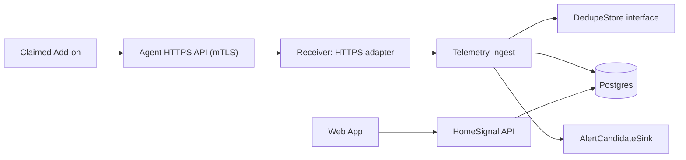

# Telemetry Ingest Architecture

This document is the guide for the first HomeSignal runtime ingestion service. It converts claimed-device HTTPS telemetry, device events, and AWS IoT lifecycle events into HomeSignal-owned database state.

Canonical device lifecycle, trust, and authority rules live in `workstreams/device-lifecycle.md`. This document applies those rules to claimed-device runtime ingestion.

Telemetry Ingest is the only service that should be separately deployable in v0. The API Facade and domain services remain in the control-plane monolith. This split exists because ingest has a distinct runtime-device-message boundary, scaling profile, and failure mode.

It is intentionally not a high-frequency time-series plan. The first service builds current product state, sparse material history, alert candidates, and a cold historical telemetry path for future product/support analysis.

## Guiding Principles

- **Agent HTTPS is the v0 telemetry/event ingress.** Claimed devices report routine telemetry and events through the mTLS `/agent/*` device API, using the same AWS IoT-signed certificate identity recorded during claim.
- **AWS IoT Core remains the realtime control/session layer.** It carries commands, notifications, compact edge state/shadows, and lifecycle presence, but routine v0 telemetry/events do not need MQTT/Basic Ingest.
- **Telemetry Ingest interprets raw IoT facts.** It validates, orders, deduplicates, and decides whether HomeSignal product state changed.
- **Postgres is product truth plus compact projections.** The main API and web app read from DB-backed read models, not from IoT Core, ingest memory, queues, or raw shadow documents.
- **Do not write every telemetry report to Postgres.** Ingest must suppress unchanged/noisy samples before persistence using material hashes, hot dedupe state, publish-policy budgets, batching, and sparse-history rules.
- **Runtime shape must preserve write suppression.** The telemetry runtime needs enough shared or long-lived state to keep dedupe/coalescing effective. A per-message stateless function that compares/writes every report directly against Postgres is not the target architecture.
- **Edge state is separate.** Compact desired/reported edge policy state belongs behind the Edge State Adapter and AWS IoT named shadows, not the telemetry/event ingest path.
- **Alerting receives candidates, not authority.** Ingest can wake alerting, but alerting verifies current DB state before creating or resolving alerts.
- **Keep phase 1 thin but well-seamed.** Use interfaces for receiver, schema catalog, dedupe store, persistence, and alert sink so later infrastructure can plug in.
- **Do not hide failure.** If telemetry cannot reach HomeSignal-owned storage, the UI should become stale/degraded rather than presenting old data as fresh.

## Scope

In scope:

- Claimed-device telemetry and event ingestion.
- AWS IoT lifecycle event ingestion for connectivity presence.
- Device health snapshots from Home Assistant, Supervisor, add-on runtime, storage, backup, update, policy, and connectivity signals, as available.
- Schema-aware validation, normalization, material hashing, and projection.
- Latest-state and presence storage for API reads.
- Sparse material event history for support/debugging.
- Best-effort alert candidate handoff.
- Backpressure, retries, rate limits, failure/quarantine metadata, and
  observability.

Out of scope:

- Enrollment and claiming.
- Unauthenticated or product-public telemetry writes.
- High-frequency sensor/time-series analytics.
- Full command lifecycle implementation.
- AWS IoT named shadow document management.
- Backups, diagnostics bundles, topology discovery, and release orchestration.
- Runtime-editable schemas or transformation rules.

Health means device/add-on/site operational health, not a separate product authority. V0 should capture whatever safe, bounded signals are available to determine whether the Home Assistant site and HomeSignal add-on appear healthy, stale, degraded, updating, backup-failing, storage-constrained, policy-drifting, or disconnected.

## System Flow

```text
Claimed add-on
  -> Agent HTTPS API over mTLS
  -> telemetry/event receiver
  -> Telemetry Ingest
  -> Postgres read models
  -> HomeSignal API
  -> Web app
```

IoT-originated ingest flow:

```text
AWS IoT lifecycle event or future IoT Rule-enriched runtime message
  -> AWS IoT receiver adapter
  -> Telemetry Ingest
  -> Postgres read models / failure tables / support-debug records
  -> HomeSignal API, alert candidates, platform-health signals
```

Alert path:

```text
Telemetry Ingest
  -> AlertCandidateSink
  -> alerting handler/service
  -> alerts table
  -> HomeSignal API reads alerts
```

MVP deployment shape:



The receiver can be local/fake for code-first development. The v0 cloud receiver is an authenticated Agent HTTPS route. A queue is intentionally not used in v0.

The v0 cloud runtime should default to a small long-lived service, such as Fargate, so one process can keep hot dedupe state, coalesce unchanged samples, and batch DB writes. Lambda may still be used for unrelated control-plane endpoints or for a future ingest adapter, but only if the ingest design preserves the same write-suppression contract with shared cache, batching, or another durable dedupe layer. A direct "one accepted telemetry message -> one Postgres write" implementation is out of bounds.

## Ingress Sources

Telemetry Ingest should normalize all runtime inputs into one internal message
model before schema handling, annotation, persistence, and alert handoff.

| Ingress source | V0/future | Auth/provenance authority | Normalized into |
| --- | --- | --- | --- |
| Agent HTTPS `/agent/telemetry` | v0 | mTLS client certificate mapped to active device credential | telemetry envelope + payload |
| Agent HTTPS `/agent/events` | v0 | mTLS client certificate mapped to active device credential | event envelope + payload |
| AWS IoT lifecycle topics | v0 | AWS IoT lifecycle event context, Thing/client ID, principal/cert metadata when available | lifecycle event envelope |
| AWS IoT Rule / Basic Ingest runtime family | future/optional | AWS IoT-authenticated transport context enriched by rule SQL; payload identity is annotation only | telemetry/event envelope + payload |

After normalization, both HTTPS and IoT-originated messages use the same
authority checks, ingest annotation pattern, persistence writers, counters,
failure handling, and alert-candidate handoff. The receiver adapter may differ;
the service response to capture/debug/quarantine annotations should not.

## Identity Model

Use one durable ingestion identity plus certificate-bound HTTPS authentication:

```text
HomeSignal device_id == AWS IoT Thing name == required MQTT client ID
  durable product identity
  stable across AWS IoT reconnects
  stable across AWS IoT credential rotation or repair when product identity continues
  used by API, UI, alerts, history, site binding

AWS IoT-signed certificate identity
  replaceable transport credential material
  presented to the Agent HTTPS API through mTLS
  recorded by provisioning/credential management
  used by backend exact fingerprint/serial lookup to derive device_id
```

The Agent HTTPS edge validates the presented certificate chain. HomeSignal authorizes the exact certificate by fingerprint/serial stored during claim and derives `device_id -> site_id -> org_id` from app DB records. Telemetry Ingest must not trust `device_id`, `site_id`, or `org_id` from request bodies.

AWS IoT connection/session fields are not HomeSignal product identity:

```text
clientId
sessionIdentifier
versionNumber
certificate ID/ARN
principalIdentifier
```

They may be available to infrastructure logs or specialized security workflows, but they are not required as a normal service join and must not replace the durable `device_id`.

Runtime ingestion identity:

```text
claimed device HTTPS request
  -> mTLS edge validates certificate chain
  -> HomeSignal backend matches certificate fingerprint/serial
  -> backend derives device_id/site_id/org_id from credential records
  -> Telemetry Ingest stores telemetry/events by device_id
```

Telemetry Ingest does not maintain a hot MQTT session-to-device mapping for normal runtime writes.

Database mapping:

```text
devices.id
  internal DB primary key used by ingest writes

devices.device_id
  durable HomeSignal device ID and AWS IoT Thing name used by API/UI/history references

device_credentials.device_pk
  FK to devices.id

device_credentials.iot_thing_name
  equals devices.device_id

device_credentials.certificate_id / certificate_arn / principal_identifier
  replaceable transport credential metadata

device_credentials.certificate_fingerprint / certificate_serial / certificate_issuer
  HTTPS device authentication lookup metadata
```

Runtime resolution rule:

```text
Agent HTTPS telemetry/event request
  -> resolve device_id from verified certificate fingerprint/serial
  -> require active claimed device and active credential for device_id
  -> update latest state/history for that device_id
```

Do not resolve lifecycle or telemetry authority by `device_id` in the payload. Authority comes from the mTLS-authenticated device certificate and HomeSignal credential record.

The payload may include device annotations for raw storage, replay, and debugging:

```json
{
  "device": {
    "homesignal_device_id": "dev_123",
    "installation_id": "inst_123",
    "agent_version": "0.1.3"
  }
}
```

Those annotations are useful when copying raw telemetry to object storage for later analysis, but they are not authoritative. If payload device identifiers disagree with the certificate-resolved durable `device_id`, reject/quarantine the message as identity drift.

Identity drift means the certificate-resolved durable identity, payload annotation, credential status, or device lifecycle state disagree.

Examples:

- Presented certificate is unknown, revoked, rotated out, or released.
- Payload device ID, if present, disagrees with the resolved device record.
- Certificate-resolved device ID maps to an unclaimed, released, revoked, or unknown HomeSignal device.

Identity drift handling:

```text
do not update product state
write telemetry_ingest_failures with reason identity_drift
record credential/request/payload provenance
send bounded device.identity_drift_detected alert candidate
```

Normal unpair/re-pair is not drift:

```text
old credential -> REVOKED
device record -> UNPAIRED
new pairing from same installation_id
new credential -> ACTIVE
same devices.id / device_id -> ACTIVE
history remains attached to the same HomeSignal device
```

## MVP Contract

### Inputs

Claimed-device runtime messages use authenticated Agent HTTPS routes. Route plus request envelope fields are the canonical message/schema contract. Payloads may repeat the same contract fields for archive/replay convenience, but ingest authority comes from the mTLS-authenticated certificate and credential record.

Telemetry, events, command ACK, and command result use the same envelope style across separate endpoints. Endpoints stay distinct for ownership, authorization, rate limits, and future evolution; backend parsing should be common.

Required envelope fields:

```text
message_type
schema_type
schema_version
message_id
applied_publish_policy_version, when policy-governed
observed_at
payload
```

Example HTTPS telemetry request:

```text
POST /agent/telemetry
message_type: telemetry
schema_type: device.health_snapshot
schema_version: 1
message_id: 01J00000000000000000000000
applied_publish_policy_version: ppv_01J00000000000000000000000
observed_at: 2026-05-14T12:00:00Z
```

Example payload:

```json
{
  "agent": {
    "status": "ok",
    "version": "0.1.3",
    "uptime_seconds": 86400,
    "cloud_connection": {
      "agent_https_reachable": true,
      "aws_iot_connected": true,
      "last_success_at": "2026-05-14T11:59:00Z",
      "last_failure_at": null
    },
    "publish_policy": {
      "applied_version": "ppv_01J00000000000000000000000",
      "issued_at": "2026-05-14T00:00:00Z",
      "refresh_after": "2026-05-15T00:00:00Z",
      "expires_at": "2026-05-21T00:00:00Z",
      "status": "current"
    },
    "update": {
      "status": "current",
      "current_version": "0.1.3",
      "desired_version": "0.1.3",
      "channel": "stable",
      "last_checked_at": "2026-05-14T11:55:00Z",
      "last_failure_reason": null
    },
    "suppression_counts": []
  },
  "home_assistant": {
    "core": {
      "status": "reachable",
      "version": "2026.5.1",
      "last_seen_at": "2026-05-14T11:59:30Z"
    },
    "supervisor": {
      "status": "reachable",
      "version": "2026.05.0",
      "last_seen_at": "2026-05-14T11:59:30Z"
    },
    "backup": {
      "status": "ok",
      "last_success_at": "2026-05-14T03:00:00Z",
      "last_failure_at": null,
      "last_failure_reason": null,
      "in_progress": false
    },
    "storage": {
      "status": "ok",
      "used_percent": 61.4,
      "free_bytes": 12884901888,
      "last_checked_at": "2026-05-14T11:59:30Z"
    }
  },
  "addons": [
    {
      "addon_id": null,
      "slug": "alarm_bridge",
      "display_name": "Alarm Bridge",
      "repository": "local",
      "status": "ok",
      "version": "1.2.3",
      "enabled": true,
      "last_seen_at": "2026-05-14T11:58:00Z",
      "update": {
        "status": "current",
        "current_version": "1.2.3",
        "latest_version": "1.2.3"
      },
      "health": {
        "state": "ok",
        "reasons": []
      },
      "activity": {
        "events_processed_last_hour": 42,
        "last_event_at": "2026-05-14T11:57:44Z"
      }
    }
  ],
  "runtime_log_summary": [
    {
      "level": "warning",
      "source": "agent",
      "component": "cloud_connection",
      "reason_code": "reconnect_backoff",
      "occurrence_count": 3,
      "first_seen_at": "2026-05-14T11:10:00Z",
      "last_seen_at": "2026-05-14T11:45:00Z",
      "sample_message": "Cloud reconnect backoff active",
      "diagnostic_excerpt": null,
      "diagnostic_excerpt_truncated": false,
      "more_logs_available": true,
      "local_artifact_ref": "logref_01J00000000000000000000000",
      "suppressed_count": 0
    }
  ]
}
```

Envelope field meanings:

| Field | Meaning |
| --- | --- |
| `message_type` | Broad runtime lane: `telemetry`, `event`, `command_ack`, `command_result`; `topology` and `knowledge` are reserved future lanes. |
| `schema_type` | Exact contract that selects validation, normalization, projection, and storage behavior. |
| `schema_version` | Positive integer version for the exact `schema_type`. |
| `message_id` | Device-generated opaque ID, preferably ULID or UUID, used for dedupe/correlation. |
| `applied_publish_policy_version` | Opaque server-issued publish-policy version the add-on actually enforced for this message. |
| `observed_at` | Device-observed timestamp for the facts, separate from cloud `received_at`. |
| `payload` | Typed JSON object. Ownership namespaces inside payload identify who observed or owns each fact. |

Initial message types:

| Message type | Source | MVP behavior |
| --- | --- | --- |
| `telemetry` | add-on | Store material current-state changes or sparse refreshes |
| `event` | add-on | Store occurrence facts for HA events, agent alarms, and `command_lifecycle` |
| `$aws/events/presence/connected/{clientId}` | AWS IoT lifecycle | Update presence online after ordering checks |
| `$aws/events/presence/disconnected/{clientId}` | AWS IoT lifecycle | Schedule delayed offline verification |
| `$aws/events/presence/connect_failed/{clientId}` | AWS IoT lifecycle | Record failure and emit bounded alert candidate |

Reserved future categories:
- diagnostics metadata
- backup metadata beyond basic summary

### Runtime Topic Payloads

`telemetry` is reported current/latest state. It answers: "what does HomeSignal need to show, compare, or alert on now?"

Initial telemetry schema types:

- `device.health_snapshot`

`device.health_snapshot` is the hourly v0 roll-up. It answers: "is the claimed
add-on locally healthy enough to operate and report, and what local Home
Assistant/add-on facts changed during the interval?"

Payload ownership namespaces:

| Namespace | Meaning |
| --- | --- |
| `agent` | Local HomeSignal runtime/add-on facts, including status, version, cloud connectivity, applied publish policy, update posture, and local suppression counters. |
| `home_assistant` | Local Home Assistant environment facts observed by the add-on, including Core, Supervisor, backup, and storage summaries. |
| `addons` | Observed Home Assistant add-ons as an array of objects, not a slug-keyed map. Slug/display name are mutable metadata; a cloud-assigned `addon_id` may be null until inventory mapping exists. |
| `runtime_log_summary` | Collapsed, redacted log-derived facts by source/component/reason/window. It is telemetry context, not a raw log stream. |

`event` messages are occurrences. They answer: "what happened that HomeSignal should record, route, or consider for alerting?"

Initial event schema types:

- `ha_event`
- `agent_alarm`
- `command_lifecycle`
- `system_event`

Event policy:

- No broad `ha_event` stream in v0.
- Device-originated event categories/types are allowlisted.
- Event volume limits are enforced both locally by the add-on and again in cloud ingest.
- Add-on publish budget is provisioned by cloud policy and enforced hard from the last accepted policy.
- The add-on receives resolved effective publish policy, not plan or tier labels.
- Publish policy includes interval rules for telemetry snapshots and event budgets for live events.
- The add-on reports `applied_publish_policy_version` with every claimed-device runtime publish as metadata only.
- If local policy is missing, expired, or invalid, the add-on falls back to conservative publishing defaults.
- Conservative defaults allow low-rate `telemetry` with `schema_type=device.health_snapshot`, backup summary only inside that low-rate snapshot when available, and `agent_alarm` under a strict security budget.
- Conservative defaults disable live `ha_event` and paid/live event behavior.
- Cloud ingest enforces current server policy immediately after entitlement or plan changes.
- Normal durable policy convergence uses the Edge State Adapter and AWS IoT named shadows.
- A scoped `refresh_publish_policy` command may force faster local convergence or repair, but correctness does not depend on it.
- `refresh_publish_policy` refreshes only event/telemetry publish allowlists, budgets, policy version, and expiry.
- `refresh_publish_policy` must not change command permissions, host-write/local execution policy, credentials, enrollment/claim state, update policy, backup policy, diagnostics policy, or remote access policy.
- Routine over-budget events are dropped/counted by cloud ingest after enough parsing to classify safely.
- Structurally suspicious or security-relevant events are quarantined.
- Sustained over-budget publishing creates an internal security/abuse signal after a threshold.
- Cloud ingest may request `refresh_publish_policy` automatically for sustained over-budget publishing; the request is idempotent and rate-limited.
- Budget authority may come from account plan, site relationship, integrator/support-provider entitlement, or another explicit server-side business rule.
- Paid/live events are not exposed in v0, but the policy shape should allow them soon without changing the runtime contract.

`agent_alarm` policy:

- Treat as internal security/abuse signal in v0.
- Do not directly create user-visible alerts in v0.
- Require severity: `info`, `warning`, or `critical`.
- Collapse repeated identical alarms by device, alarm type, and time window while preserving first seen, last seen, count, and sample provenance.
- If `agent_alarm` is missing `applied_publish_policy_version`, accept it as an internal signal with `applied_publish_policy_version=unknown` and record a contract-defect metric.
- Accept policy-application failure alarms such as `publish_policy_apply_failed` and `publish_policy_rejected_suspicious` as internal operational/security signals.
- Accept `artifact_upload_failed` as an internal operational signal, but do not use it to automatically request another `error_log_bundle`.
- Policy-application failure alarms must be bounded structured payloads. They may include a redacted diagnostic excerpt capped at 5 KB total.
- Ingest must reject or quarantine oversized excerpts, raw policy blobs, signed URLs, secrets, or local file contents beyond the bounded redacted excerpt sent inside runtime events.
- If `more_logs_available` is present, ingest records the hint/correlation ID so cloud services may decide whether to request a brokered `error_log_bundle`.
- Ingest records upload-failure suppression counters when reported so operations can see an error storm was collapsed.

Large log handling:

- Runtime event requests carry only summary/error facts.
- Runtime events may carry a redacted diagnostic excerpt capped at 5 KB total for immediate triage.
- Large logs, traces, or diagnostic bundles beyond that excerpt use the approved brokered artifact path documented in `artifact-upload-broker.md`.
- An agent alarm may include `more_logs_available` and a local correlation ID, but not bulk diagnostic content.

Runtime telemetry/event routes are only for already-claimed devices using durable device credentials. Registration/bootstrap traffic must not share these routes.

Optional/future AWS IoT topic/rule routing is documented separately in `aws-iot-routing-contract.md`.

Cloud-to-device commands use normal MQTT broker topics because the add-on subscribes to them. V0 device-to-cloud telemetry/events use Agent HTTPS. A future runtime family may move to AWS IoT Basic Ingest only when MQTT/rules semantics or scale justify it.

AWS IoT named shadows are the separate desired/reported edge-state surface and are documented in `edge-state-adapter.md`. Telemetry Ingest may consume shadow-derived projections later, but it must not become the owner of shadow documents.

### Outputs

Telemetry Ingest writes:

- `device_presence`
- `device_latest_state`
- `device_lifecycle_events`
- `device_telemetry_events`
- `telemetry_ingest_failures`
- bounded support/debug capture records or references when an ingress annotation
  requires them

Telemetry Ingest may send alert candidates through:

```text
AlertCandidateSink
  phase 1: POST /internal/alert-candidates or in-process adapter
  future: SQS/EventBridge adapter
```

The main API reads Postgres. It does not read from IoT Core, ingest memory, DedupeStore, or ingest queues.

## Processing Pipeline

Keep the service internally modular even when it deploys as one process:

```text
Receiver
  accepts local/fake input first; cloud receiver adapter later

EnvelopeParser
  parses route/headers/body into envelope + payload

SchemaCatalog / SchemaHandler
  validates, normalizes, selects material fields, projects DB fields

DeviceAuthorityResolver
  resolves device/account/site/credential state from registry cache + Postgres

LifecycleEvaluator
  handles connected/disconnected/connect_failed ordering and debounce

StateEvaluator
  compares material/sidecar hashes and decides whether persisted state changed;
  this is the first write-protection stage

IngestAnnotationEvaluator
  checks publish policy, debug sessions, watch rules, and failure classification
  attaches internal capture/retention/logging annotations

DedupeStore
  remembers hot dedupe entries and pending lifecycle candidates so unchanged
  samples can be dropped without round-tripping every report through Postgres

PersistenceWriter
  batches writes to Postgres; it writes latest state, sparse material history,
  and failure/support records, not every accepted unchanged sample

AlertCandidateSink
  sends best-effort alert candidates after DB writes

FailureSink
  records reject/quarantine metadata; DLQ metadata is future-only if a later
  architecture decision introduces a queue
```

MVP message flow:

```text
1. Receive message.
2. Parse envelope and payload.
3. Resolve SchemaHandler by message_type + schema_type + schema_version.
4. Validate envelope fields, payload, schema version, and timestamps.
5. Resolve device authority and status.
6. Reject/quarantine unknown, revoked, released, or mismatched devices.
7. Evaluate publish policy, active debug sessions, watch rules, and failure/quarantine conditions.
8. Attach internal ingest annotations for capture level, retention, matched rule, and logging response.
9. Normalize payload and project fields through SchemaHandler.
10. Compute message_hash, material_hash, and optional sidecar_hash.
11. Check DedupeStore.
12. Decide whether DB writes, support/debug records, counters, or quarantine records are needed.
13. Commit DB writes.
14. Update DedupeStore only after DB commit succeeds.
15. Send best-effort alert candidate if warranted.
16. Ack the input message.
```

Do not ack input before required DB writes commit.

## Ingress Annotation Pattern

Telemetry Ingest is the service that flags runtime messages for elevated
attention. The sender is not authoritative for this flag.

The add-on may include ordinary facts such as routine log level, component,
reason code, `applied_publish_policy_version`, and payload fields. It must not
be trusted to decide cloud capture, retention, or support/debug routing.

Annotation inputs:

- authenticated device identity derived from mTLS certificate metadata
- current device/site/org state
- current server-side publish policy
- active debug sessions for the device/site
- internal watch rules for support/ops investigations
- envelope message_type/schema_type/schema_version
- payload classification such as log level, component, reason code, and
  diagnostic excerpt presence
- ingest failure classification such as schema rejection, identity drift,
  over-budget, suspicious payload, or quarantine

Internal annotation shape:

```json
{
  "capture_level": "normal",
  "capture_reason": "publish_policy",
  "debug_session_id": null,
  "watch_rule_id": null,
  "retention": "product_state",
  "cloud_log_level": "info",
  "quarantine": false
}
```

Capture levels:

| Level | Behavior |
| --- | --- |
| `none` | Drop/count or suppress unchanged sample with aggregate counters only. |
| `normal` | Product-state write, sparse history when material, aggregate metrics. |
| `support` | Retain bounded support/debug reference or structured sample. |
| `debug` | Retain richer debug copy under active debug session TTL/budget. |
| `quarantine` | Do not update product state; write bounded failure metadata. |

Cloud log-level response:

- Normal accepted telemetry/events should not produce one CloudWatch log line per
  message unless needed during local/staging development.
- Validation failures, drops, over-budget decisions, and unchanged suppressions
  should emit aggregate counters and sampled structured logs.
- `support`/`debug` captures may emit higher-detail structured logs or S3
  summaries, bounded by debug/watch configuration.
- `quarantine` may emit warning/error operational logs, but must redact payloads
  and avoid log storms through sampling/collapse windows.
- Device/site/account IDs may appear in structured logs only where authorized
  and safe; they must not become CloudWatch metric dimensions.

Downstream services should not reinterpret raw device payloads to decide
observability level. They should consume the normalized record, command/debug
session status, support/debug references, or alert candidates produced by ingest.

## Schema Catalog

Schemas are HomeSignal contracts, not Home Assistant contracts. Home Assistant/Supervisor versions are runtime context and catalog test notes, not primary schema selectors.

Lookup key:

```text
family
category
type
schema_version
```

Phase 1 catalog source:

```text
schema definitions and handlers are packaged with the ingestion image
catalog loads them into memory on boot
schema support changes require an ingestion deploy
```

`SchemaCatalog` API:

```text
GetHandler(family, category, type, schema_version)
ListSupported()
```

`SchemaHandler` responsibilities:

```text
Validate(envelope, payload)
Normalize(payload)
MaterialFields(payload)
SidecarFields(payload)
Project(payload)
```

Unsupported schema behavior:

```text
unknown message_type/schema_type/schema_version
  -> reject or quarantine
  -> write telemetry_ingest_failures
  -> send rate-limited device.schema_rejected alert candidate
  -> do not update latest product state
```

Future seam:

```text
SchemaHandler -> optional Transformer -> StateEvaluator
```

Do not implement transformation in MVP. If added later, it must be versioned and tested like schema handling.

## Hash And Dedupe Model

Use separate hashes for separate jobs:

| Hash | Input | Purpose |
| --- | --- | --- |
| `message_hash` | Canonical full envelope plus payload, excluding cloud transport metadata | Exact duplicate/debug identity |
| `material_hash` | Canonical fields that change user-visible or operational state | DB write decision |
| `sidecar_hash` | Optional secondary data such as version, health summary, counters | Auxiliary change detection |

Payload device annotations can be included in `message_hash` for replay/debug identity. They must not be included in `material_hash` unless a schema handler explicitly treats a field as product state.

`material_hash` ignores noisy sample fields:

- `message_id`
- `sequence`
- `observed_at`
- `received_at`
- connection/session ID
- retry attempt
- local collection duration

`material_hash` includes product state:

- reported health/degraded state
- agent, Home Assistant Core, Supervisor, and add-on versions
- backup summary
- update summary
- storage thresholds
- add-on and integration health summaries

Phase 1 DedupeStore:

```text
DedupeStore interface
  -> MemoryDedupeStore implementation
```

Future backends:

- `TieredDedupeStore`: memory + SQLite + S3 snapshot.
- `RedisDedupeStore` / `ValkeyDedupeStore`: only if horizontal scale needs shared cache.

Cache update rule:

```text
DB commit succeeds
  -> update DedupeStore persisted hashes
```

Never let cache state claim persistence before the DB commit succeeds.

## Connectivity Presence

AWS IoT lifecycle events are the cloud connectivity signal.

Required handling:

- Require `clientId` to equal the AWS IoT Thing name and HomeSignal `device_id` for claimed devices.
- Validate `principalIdentifier`, certificate ID, and `thingName` when available.
- Use the AWS IoT lifecycle event's authenticated client/Thing identity before updating product state.
- Store `sessionIdentifier`, `versionNumber`, event timestamp, event type, and processed time.
- Apply `connected` quickly when newer than stored presence.
- Do not apply `disconnected` immediately.
- Store pending disconnect and schedule delayed verification.
- Mark offline only if no newer connected event has arrived for the same client.
- Ignore duplicate and stale lifecycle events idempotently.

Disconnect debounce:

```text
disconnect event arrives
  -> persist pending disconnect candidate
  -> wait 5-15 seconds
  -> verify current presence row
  -> if newer connection exists, ignore disconnect
  -> if same disconnect is still current, mark OFFLINE
```

Use AWS IoT `versionNumber` for ordering when possible, but do not rely on simple numeric ordering alone. If the value resets after a long offline period, fall back to stored presence, event timestamp, session identifier, and delayed verification.

## Alert Candidate Contract

Alerting is a logical service boundary. It can initially live inside the API monolith.

Phase 1 handoff:

```text
POST /internal/alert-candidates
```

Request shape:

```json
{
  "candidate_id": "presence-dev_123-2026-05-11T12:00:00Z",
  "event_type": "device.presence_changed",
  "device_id": "dev_123",
  "account_id": "acct_123",
  "site_id": "site_123",
  "occurred_at": "2026-05-11T12:00:00Z",
  "previous_state": {
    "status": "ONLINE"
  },
  "new_state": {
    "status": "OFFLINE"
  },
  "source": "telemetry_ingest"
}
```

Alerting must read the DB before creating or resolving alerts. The candidate is a wake-up signal; the DB is authority.

Alert candidates are not deduped like telemetry. Ingest may rate-limit repeated candidates in memory, but durable alert idempotency belongs to the alerting side using `candidate_id` and DB uniqueness. This prevents an ingest restart from creating permanent duplicate alert authority.

Initial candidates:

| Candidate | Source |
| --- | --- |
| `device.presence_changed` | AWS IoT lifecycle evaluation |
| `device.connect_failed` | AWS IoT connect_failed lifecycle event |
| `device.identity_drift_detected` | credential/topic/payload/lifecycle identity mismatch |
| `device.telemetry_health_changed` | material health telemetry change |
| `device.backup_summary_changed` | material backup summary change |
| `device.schema_rejected` | unsupported/invalid schema after rate limiting |
| `device.connected_but_telemetry_stale` | IoT says connected but accepted telemetry is stale |
| `device.telemetry_rate_limited` | sustained device/account rate limit |
| `device.telemetry_ingest_degraded` | DB/cache/alert sink degradation |

Connected-but-telemetry-stale fallback:

```text
if device_presence.status == ONLINE
and latest accepted telemetry/report is older than 3 hours
then send device.connected_but_telemetry_stale
```

Use direct best-effort handoff for MVP alerting. Add transactional outbox later for higher-consequence flows such as credential revoke, device release, command lifecycle, audit/security, or billing.

## Persistence Model

Minimum Postgres table families:

### `device_presence`

One row per device.

Fields:

- `device_pk`
- `device_id`
- `account_id`
- `site_id`
- `status`: `ONLINE`, `STALE`, `OFFLINE`, `DEGRADED`, `REVOKED`
- `last_connected_at`
- `last_disconnected_at`
- `last_lifecycle_event_at`
- `active_credential_id`
- `current_iot_thing_name`
- `current_principal_identifier`
- `last_connection_id`
- `current_session_identifier`
- `last_lifecycle_version_number`
- `pending_disconnect_session_identifier`
- `pending_disconnect_version_number`
- `pending_disconnect_at`
- `last_accepted_telemetry_at`
- `agent_version`
- `updated_at`

`device_presence` is the API read model for cloud connectivity and coarse health.

### `device_lifecycle_events`

Retention-limited support/security history for AWS IoT lifecycle signals.

Fields:

- `id`
- `device_pk`
- `device_id`
- `credential_id`
- `account_id`
- `site_id`
- `client_id`
- `thing_name`
- `principal_identifier`
- `session_identifier`
- `version_number`
- `event_type`: `connected`, `disconnected`, `connect_failed`
- `disconnect_reason`
- `connect_failure_reason`
- `client_initiated_disconnect`
- `event_timestamp`
- `received_at`
- `ingest_result`

### `device_latest_state`

One row per device and telemetry schema type/version.

Fields:

- `device_pk`
- `device_id`
- `account_id`
- `site_id`
- `message_type`
- `schema_type`
- `schema_version`
- `applied_publish_policy_version`
- `message_hash`
- `material_hash`
- `sidecar_hash`
- `payload_json`
- projected fields needed for API filters and alerting
- `sequence`
- `observed_at`
- `received_at`
- `changed_at`
- `last_refreshed_at`
- `unchanged_count`

### `device_telemetry_events`

Append-only sparse material history.

Fields:

- `id`
- `device_pk`
- `device_id`
- `account_id`
- `site_id`
- `message_id`
- `message_type`
- `schema_type`
- `schema_version`
- `applied_publish_policy_version`
- `message_hash`
- `material_hash`
- `sidecar_hash`
- `payload_json`
- `observed_at`
- `received_at`
- `ingest_result`

Do not store every unchanged sample.

Postgres is not the long-term historical telemetry lake. Keep it focused on
latest state, sparse material history, support/debug references, and product UI
queries that need ordinary database latency. Historical telemetry should also be
written or exported to object storage in a device-rooted partitioned form so the
platform can evolve analytics, support tooling, and backfill/replay features
without committing v0 to a dedicated time-series database.

V0 retention policy:

- `device_latest_state` remains in Postgres while the device exists, subject to
  device lifecycle and deletion policy.
- `device_telemetry_events` keeps a 7-day hot window for product UI, support,
  and archive-worker retry buffer.
- After a device/day leaves the hot window, an archive worker writes the
  completed daily file and summary to object storage.
- After archive verification, archived historical rows older than the hot window
  may be pruned from Postgres.
- On device deletion, product telemetry history and cold archives are deleted
  after a 7-day operational grace period.
- Audit/security records are governed separately and are not deleted merely
  because telemetry history aged out or product telemetry is deleted. They must
  retain minimized authority/security facts, not raw telemetry payloads.

Cold archive layout must be device-rooted so device telemetry can be removed or
retained as a unit without scanning date-rooted prefixes.

Suggested cold archive shape:

```text
s3://.../telemetry-history/env={env}/device_id={device_id}/year=YYYY/month=MM/day=DD/telemetry.ndjson
```

Account/site/org identifiers remain fields inside each archive record and may be
included in a manifest or secondary index later, but they should not be the root
of the object key. Device-rooted storage makes deletion, export, and
per-device retention operationally simple.

If volume or writer concurrency requires multiple objects, use part files under
the same device/day partition:

```text
s3://.../telemetry-history/env={env}/device_id={device_id}/year=YYYY/month=MM/day=DD/part-000001.ndjson
```

Prefer daily plain NDJSON for v0. Hourly partitions are only needed for
debug/verbose volume or operational recovery needs. Do not write one object per
telemetry message. Compression, compaction, and colder storage-class lifecycle
transitions are later cost optimizations once real telemetry volume justifies
the extra inspection friction.

Archive records should contain the normalized envelope, resolved device/site/org
identity, `message_type`, `schema_type`, `schema_version`,
`applied_publish_policy_version`, material/sidecar hashes, ingest result, and
redacted payload. Do not use CloudWatch Logs as the product telemetry archive.

For support and future LLM consumption, the archive may add deterministic daily
summaries beside raw records:

```text
s3://.../telemetry-history/env={env}/device_id={device_id}/year=YYYY/month=MM/day=DD/summary.json
```

These summaries should be generated from normalized records and should contain
boring, deterministic facts: health changes, backup summaries, agent alarms,
command outcomes, policy changes, add-on inventory changes, debug-session
references, artifact references, and bounded reason-code summaries. They are
not product authority and should be rebuildable from the underlying archive and
database facts.

Why a semi-fast DB view may still matter:

- portal can show recent device state/history without building an analytics
  query path first
- support can answer "what changed recently?" during an incident
- alerting/platform-health can correlate recent material changes without scanning
  object storage
- sparse history helps validate schema and add-on changes during early platform
  evolution

V0 should avoid promising broad historical analytics. If product requirements
later need dense time-over-time charts, fleet analytics, or long-window queries,
evaluate a time-series/analytics store such as Timestream, Influx, ClickHouse,
Athena over S3, or similar at that point.

### `telemetry_ingest_failures`

Operational failure/quarantine table.

Fields:

- `id`
- `message_id`
- `device_pk`, if resolved
- `device_id`
- `failure_reason`
  - `raw_topic`
- `provider_identity_key`, if known
- `credential_id`, if known
- `claimed_topic_device_id`, if present
- `claimed_payload_device_id`, if present
- `schema_key`, if known
- `agent_version`, if known
- `received_at`
- `retryable`

Do not store secrets or full large payloads here.

### `telemetry_support_captures`

Bounded support/debug capture metadata for messages that matched an ingress
annotation.

Fields:

- `id`
- `device_pk`
- `device_id`
- `account_id`
- `site_id`
- `message_id`
- `message_type`
- `schema_type`
- `schema_version`
- `capture_level`: `support`, `debug`, or `quarantine`
- `capture_reason`
- `debug_session_id`, when applicable
- `watch_rule_id`, when applicable
- `message_hash`
- `payload_excerpt_json`, bounded and redacted
- `artifact_id` or object reference, when larger debug material went to S3
- `retention_expires_at`
- `received_at`

This table stores references and bounded excerpts, not raw unbounded device
streams. Larger debug material uses the Artifact Upload Broker and S3.

## Backpressure And Failure Behavior

The inbound receiver is the intake boundary. In v0 there is no queue in this path; keep intake bounded and rely on HTTP status codes, rate limits, operational alarms, and bounded device retry behavior.

Runtime selection is part of backpressure design. If the chosen substrate cannot preserve `dedupe_cache_ttl`, `input_batch_size`, and `db_write_batch_size` semantics, use a long-lived worker or add a shared dedupe/batching layer before accepting the design. Falling back to DB-backed comparison is a degraded mode for short incidents, not the steady-state cost model.

Initial controls:

| Control | Default |
| --- | --- |
| `max_inflight_messages` | small fixed cap, start around 25 |
| `input_batch_size` | start around 10 if the receiver batches |
| `db_write_batch_size` | start around 50 |
| `disconnect_debounce` | 10 seconds |
| `connected_but_telemetry_stale_threshold` | 3 hours |
| `registry_cache_ttl` | 30-120 seconds |
| `dedupe_cache_ttl` | 24 hours |
| `telemetry_refresh_interval` | 10-15 minutes |

Priority under pressure:

```text
1. AWS IoT lifecycle events.
2. `command_lifecycle` ack/results.
3. Material telemetry changes.
4. Periodic refreshes.
5. Unchanged/noisy samples.
```

Failure handling:

| Failure | Behavior |
| --- | --- |
| HTTPS telemetry/event request fails on device | add-on treats telemetry as unsent and retries locally with bounds |
| Receiver unavailable | operational alarm; ingestion delayed or rejected depending transport |
| Ingest worker down | request fails or times out; device retries within local budget |
| Postgres unavailable | do not ack input; retry with backoff |
| AlertCandidateSink unavailable | persist DB state; skip/retry candidate; alert reconciliation repairs later |
| DedupeStore unavailable | fall back to DB-backed write decisions or less efficient writes |
| Unsupported schema flood | rate-limit failures and candidates |
| Identity drift | reject/quarantine, do not update product state, emit bounded alert candidate |
| Device/account flood | token bucket limits for non-lifecycle messages |
| Out-of-order lifecycle event | ordering checks and disconnect debounce prevent false transitions |
| Unknown/revoked device | reject or quarantine; do not update product state |

## Observability

Telemetry Ingest must expose:

- messages received by message_type/schema_type/schema_version
- messages written to DB
- messages suppressed as unchanged
- lifecycle events processed, delayed, ignored, and applied
- rejected/quarantined messages
- receiver processing lag
- retry counts where the receiver owns retry behavior; DLQ counts only if a
  future queue is deliberately introduced
- ingest latency from `observed_at` to DB commit
- DB write latency
- cache hit/miss rate
- in-flight message count
- rate-limited device/account count
- alert candidate delivery failures
- schema rejection counts by schema key and agent version
- publish-policy violation counts by device/account/schema type
- runaway-message candidate counters by device/account/message type
- over-budget drop/count rates by device/account/schema type
- artifact upload failure and suppression counters
- debug/watch matched message counts
- support/debug capture byte counts
- quarantine capture counts by reason

Key product sanity metric:

```text
received messages vs persisted writes
```

This shows whether dedupe is protecting storage.

For normal hourly health snapshots, persisted writes should be materially lower than received messages after the first unchanged steady-state period. If this ratio approaches 1:1 for unchanged telemetry, the ingest implementation is violating the architecture even if the API still works.

Future Platform Health / Monitoring consumes summarized ingest counters and findings for slower cross-service correlation, including runaway IoT messaging patterns. Telemetry Ingest remains responsible for hot-path validation, drop/count, and quarantine; Platform Health / Monitoring should not sit in the hot path.

## Future Extension Points

Keep these as seams, not MVP implementation:

- Raw telemetry archive replication to object storage for analytics, replay, and backfill.
- SQS/EventBridge-backed `AlertCandidateSink`.
- SQS/stream-backed `Receiver`.
- SQLite/S3-backed `TieredDedupeStore`.
- Redis/Valkey shared dedupe for horizontal scale.
- Signed schema bundle loaded from S3/DB.
- Versioned transformation stage.
- Transactional outbox for high-consequence events.
- Time-series/metrics store for high-frequency analytics.

## Acceptance Criteria

- Claimed-device telemetry/events enter through the mTLS Agent HTTPS API, not public or unauthenticated API writes.
- AWS IoT Basic Ingest is optional/future for runtime families that need MQTT/rules semantics or a different scale/cost profile.
- Cloud-to-device commands remain on normal MQTT broker topics.
- Desired/reported edge state remains behind the Edge State Adapter and AWS IoT named shadows.
- AWS IoT lifecycle connected/disconnected/connect_failed events enter ingestion.
- Disconnected events are debounced and verified before marking offline.
- Stale disconnects cannot overwrite newer connected events.
- Ingest resolves payloads through `SchemaCatalog`.
- Unsupported schemas are rejected/quarantined and do not update latest state.
- Ingest validates device authority against HomeSignal registry before writing.
- Ingest uses certificate-resolved `device_id` and requires an active claimed device record before accepting runtime state.
- Identity drift is rejected/quarantined and does not update product state.
- Ingest writes `device_presence` and `device_latest_state` for API reads.
- Ingest suppresses unchanged telemetry writes using `material_hash`.
- Ingest does not persist every accepted unchanged telemetry report.
- Ingest exposes received-message versus persisted-write metrics before staging ingest is considered ready.
- Ingest runtime selection explains where hot dedupe/coalescing state lives and how it survives concurrency, restarts, and cold starts.
- Ingest refreshes latest state periodically so the UI does not look fresh forever.
- Ingest updates `last_accepted_telemetry_at` for accepted telemetry.
- Ingest can emit `connected_but_telemetry_stale` after a conservative threshold.
- Ingest sends alert candidates through `AlertCandidateSink`.
- Alerting verifies current DB state before creating/resolving alerts.
- Ingest has explicit stage boundaries for parsing, schema handling, authority, evaluation, dedupe, persistence, and alert handoff.
- Ingest applies bounded concurrency/rate limits for one small worker.
- Ingest prioritizes lifecycle/material changes over unchanged samples under pressure.
- Ingest handles duplicate and stale messages idempotently.
- Ingest does not ack input before required DB writes commit.
- API reads telemetry and alerts from Postgres-backed read models.
